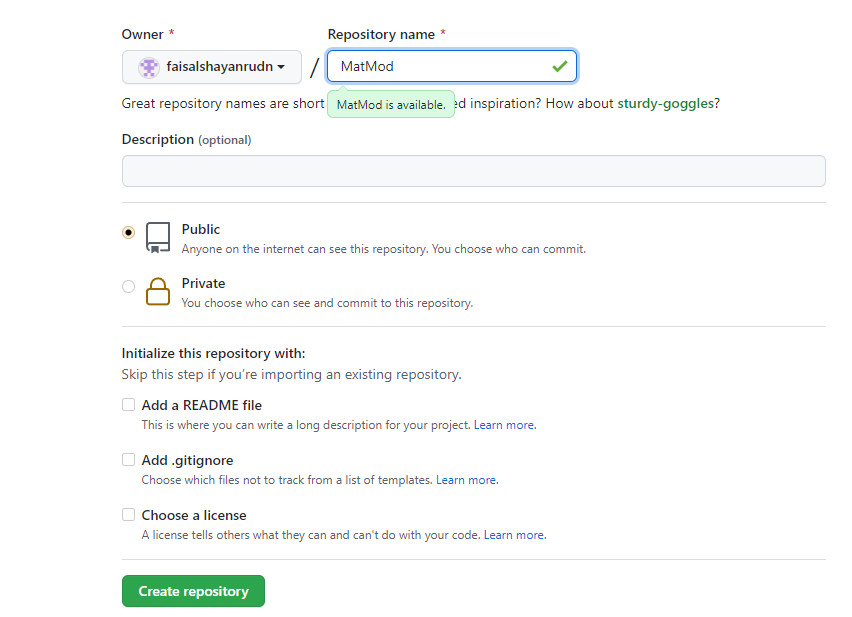
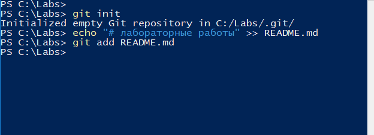
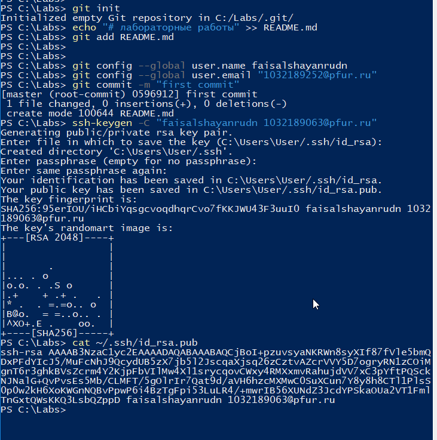
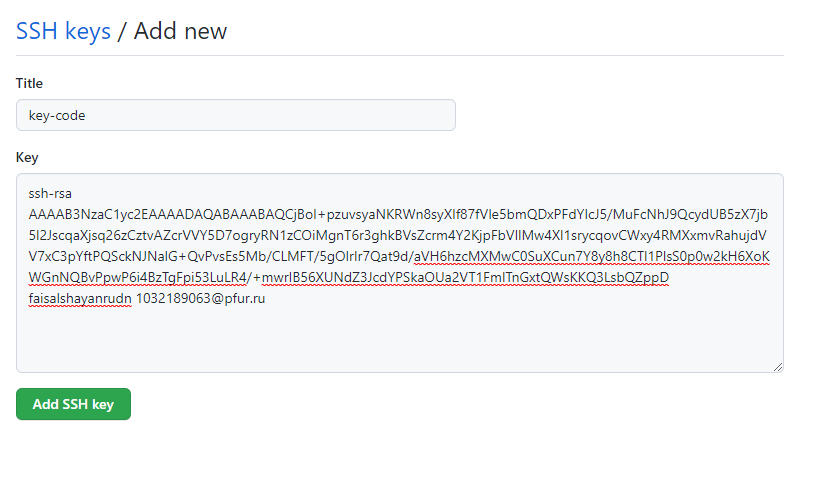
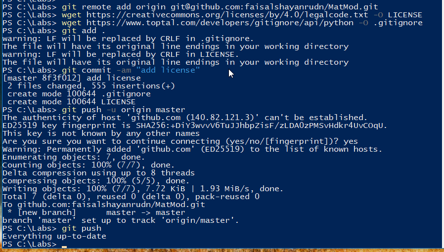
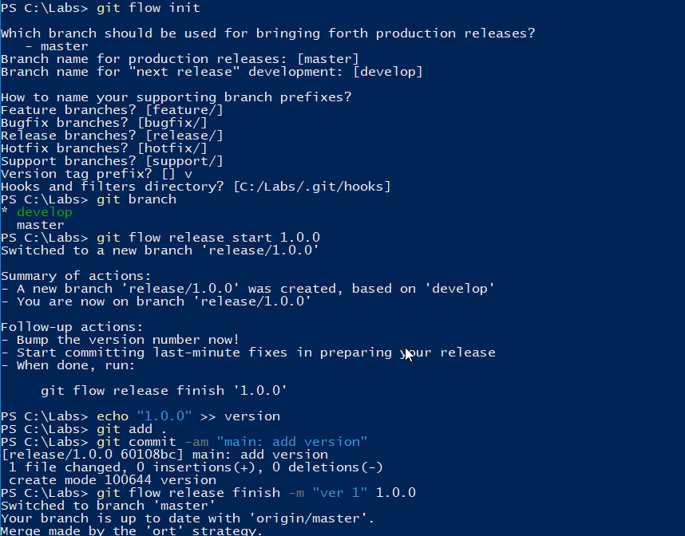
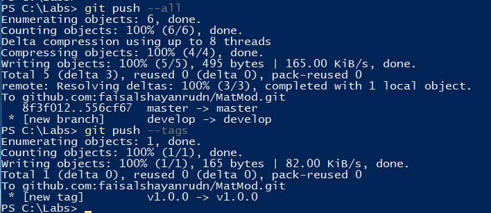
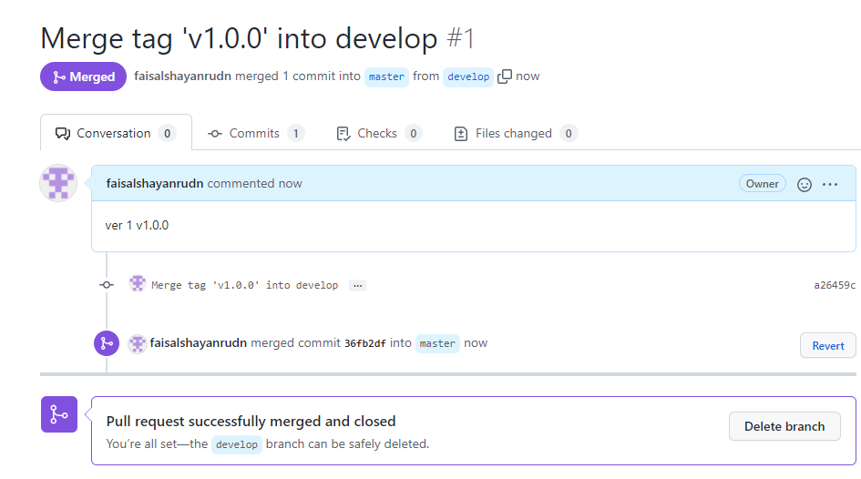

---
# Front matter
title: "Отчёт по лабораторной №1. Работа с GIT"
subtitle: "Подготовка, установка и приминение git"
author: "Шаян Фаисал НФИбд-02-19"

# Generic otions
lang: ru-RU
toc-title: "Содержание"

# Bibliography
bibliography: bib/cite.bib
csl: pandoc/csl/gost-r-7-0-5-2008-numeric.csl

# Pdf output format
toc: true # Table of contents
toc_depth: 2
lof: true # List of figures
fontsize: 12pt
linestretch: 1.5
papersize: a4
documentclass: scrreprt
## I18n
polyglossia-lang:
  name: russian
  options:
	- spelling=modern
	- babelshorthands=true
polyglossia-otherlangs:
  name: english
### Fonts
mainfont: PT Serif
romanfont: PT Serif
sansfont: PT Sans
monofont: PT Mono
mainfontoptions: Ligatures=TeX
romanfontoptions: Ligatures=TeX
sansfontoptions: Ligatures=TeX,Scale=MatchLowercase
monofontoptions: Scale=MatchLowercase,Scale=0.9
## Biblatex
biblatex: true
biblio-style: "gost-numeric"
biblatexoptions:
  - parentracker=true
  - backend=biber
  - hyperref=auto
  - language=auto
  - autolang=other*
  - citestyle=gost-numeric
## Misc options
indent: true
header-includes:
  - \linepenalty=10 # the penalty added to the badness of each line within a paragraph (no associated penalty node) Increasing the value makes tex try to have fewer lines in the paragraph.
  - \interlinepenalty=0 # value of the penalty (node) added after each line of a paragraph.
  - \hyphenpenalty=50 # the penalty for line breaking at an automatically inserted hyphen
  - \exhyphenpenalty=50 # the penalty for line breaking at an explicit hyphen
  - \binoppenalty=700 # the penalty for breaking a line at a binary operator
  - \relpenalty=500 # the penalty for breaking a line at a relation
  - \clubpenalty=150 # extra penalty for breaking after first line of a paragraph
  - \widowpenalty=150 # extra penalty for breaking before last line of a paragraph
  - \displaywidowpenalty=50 # extra penalty for breaking before last line before a display math
  - \brokenpenalty=100 # extra penalty for page breaking after a hyphenated line
  - \predisplaypenalty=10000 # penalty for breaking before a display
  - \postdisplaypenalty=0 # penalty for breaking after a display
  - \floatingpenalty = 20000 # penalty for splitting an insertion (can only be split footnote in standard LaTeX)
  - \raggedbottom # or \flushbottom
  - \usepackage{float} # keep figures where there are in the text
  - \floatplacement{figure}{H} # keep figures where there are in the text
---

# Цель лабораторной работы №1

Целью данной лабораторной работы является изучение пространства git, применение раздичных команд и отработка эллементарных действий с системой.

# Ход работы лабораторной №1

Создаем учетную запись на github.com и репозиторий, в котором в дальнейшем будем работать

{ #fig:001 width=80% height=80% }

Инициализируем созданный нами локальный репозиторий, после создаем в нем файл README.md, с которым будем проводить все дальнейшие действия

{ #fig:002 width=80% height=80% }

Создаем SSH-ключ, который пропишем в настройках на github.com

{ #fig:003 width=80% height=80% }

{ #fig:004 width=80% height=80% }

Загружаем файлы лицензионного соглашения и gitignore и отправляем эти файлы в сетевой репозиторий.

{ #fig:005 width=80% height=80% }

Используем системы управления версиями и тегами. Создаем ветку, начинаем и завершаем в ней релиз.

{ #fig:006 width=80% height=80% }

{ #fig:007 width=80% height=80% }

Выполняем объединение веток с помощью простых команд. 

{ #fig:008 width=80% height=80% }

# Вывод: 

Мы приобрели практические навыки работы с системой контроля версий git и создали свой репозиторий. Изучили пространства git, применили различные команды и отработали эллементарные действий с системой.

# Список литературы {.unnumbered}

1. [Git Шпаргалка](https://github.com/cyberspacedk/Git-commands)
2. [Основы Git](https://habr.com/ru/post/583478/)
3. [Руководство по оформлению Markdown файлов](https://gist.github.com/Jekins/2bf2d0638163f1294637)
